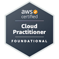
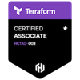

# Mon profil personnel / My personnal profile

## Curriculum Vitae

À venir bientôt ... / It come as soon ...

## Notes

> Les travaux associés à cet identifiant GitHub sont personnels et ne représente en aucun cas l'entreprise pour qui j'ai travaillé dans le passé ou à laquelle je travaille actuellement.
>
> The work associated with this GitHub ID is personal and in no way represents the company I have worked in the past or I currently work.